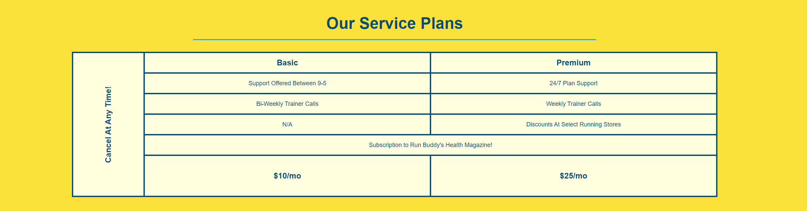

# Run Buddy

## Description:
This project was one of the first ones I completed at the UT coding bootcamp and was desinged to teach the basics of proper HTML and CSS structure, and also dive in to more robust css features like flexbox and responsive design.

# Table of Contents

- [Repository](#repository)
- [Examples](#examples)
- [Technologies Used](#technologies-used)
- [Questions](#questions)
- [Contributions](#contributing)
- [License](#license)

## Repository:

---

- [My Github Profile](https://github.com/Grey-Whitt)

- [This Repository](https://github.com/Grey-Whitt/run-buddy)

- [Deployed Application](https://grey-whitt.github.io/run-buddy/) 

## Examples

---

Here is a section of the site and the css behind it.



I used flex and grid to arrange the layout
```
/* Service styles start */

.services {
    background: var(--primary-color); 
}
  
.service-grid-wrapper {
    display: flex;
    width: 100%;
    justify-content: center;
}

.service-grid-container {
    display: grid;
    grid-template-columns: 1fr repeat(2, 4fr);
    grid-template-rows: repeat(5, 1fr) 2fr;
    background-color: lightyellow;
    width: 80%;
    border: 2px solid var(--secondary-color);
    font-size: 18px;
    color: var(--secondary-color);
}

.service-grid-item {
    padding: 15px 0;
    border: 2px solid var(--secondary-color);
    display: flex;
    align-items: center;
    justify-content: center;
    text-align: center;
}

/* specific match */
.service-grid-item.basic {
    grid-column: 2 / span 1;
}

.both {
    grid-column: 2 / span 2;
}

.service-grid-item.cancel {
    writing-mode: vertical-lr;
    transform: rotate(180deg);
    grid-row: 1 / -1;
}

.grid-head, .grid-price, .service-grid-item.cancel {
    font-size: 1.5rem;
    font-weight: bold;
}

```


## Technologies Used

---

HTML  
CSS


## Questions

---

If you have any questions feel free to email me or find me on LinkedIn

[greywhitt@gmail.com](mailto:greywhitt@gmail.com)

[My LinkedIn](https://www.linkedin.com/in/grey-whittenberger)

[www.greywhitt.com](www.greywhitt.com)

## Contributing:

---

[](./uploads/CODE_OF_CONDUCT.md)

Contributions, issues and feature requests are welcome.

## License:

---


Copyright 2022 Grey Whittenberger

Permission is hereby granted, free of charge, to any person obtaining a copy of this software and associated documentation files (the "Software"), to deal in the Software without restriction, including without limitation the rights to use, copy, modify, merge, publish, distribute, sublicense, and/or sell copies of the Software, and to permit persons to whom the Software is furnished to do so, subject to the following conditions:

The above copyright notice and this permission notice shall be included in all copies or substantial portions of the Software.

THE SOFTWARE IS PROVIDED "AS IS", WITHOUT WARRANTY OF ANY KIND, EXPRESS OR IMPLIED, INCLUDING BUT NOT LIMITED TO THE WARRANTIES OF MERCHANTABILITY, FITNESS FOR A PARTICULAR PURPOSE AND NONINFRINGEMENT. IN NO EVENT SHALL THE AUTHORS OR COPYRIGHT HOLDERS BE LIABLE FOR ANY CLAIM, DAMAGES OR OTHER LIABILITY, WHETHER IN AN ACTION OF CONTRACT, TORT OR OTHERWISE, ARISING FROM, OUT OF OR IN CONNECTION WITH THE SOFTWARE OR THE USE OR OTHER DEALINGS IN THE SOFTWARE.

For more information about licenses, please visit:
[License](https://opensource.org/licenses/MIT)
